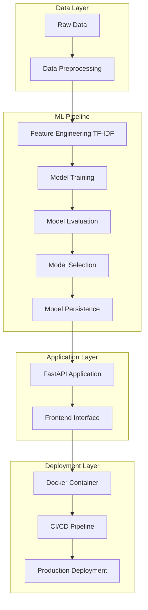
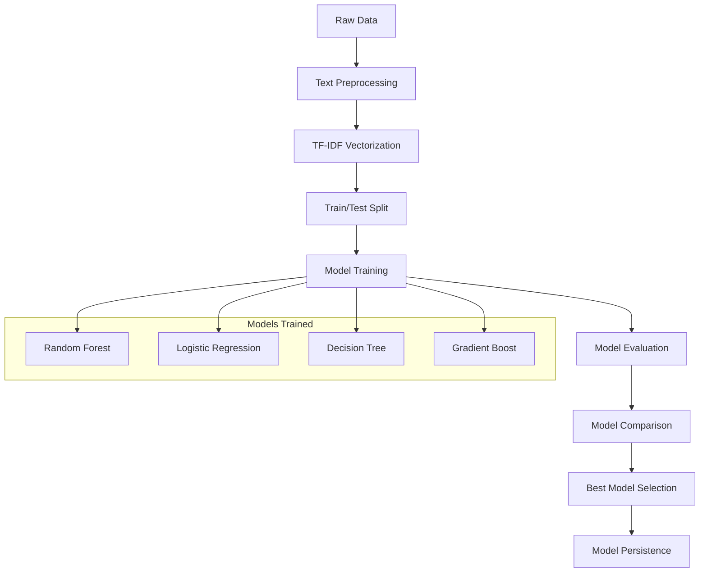
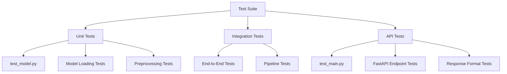
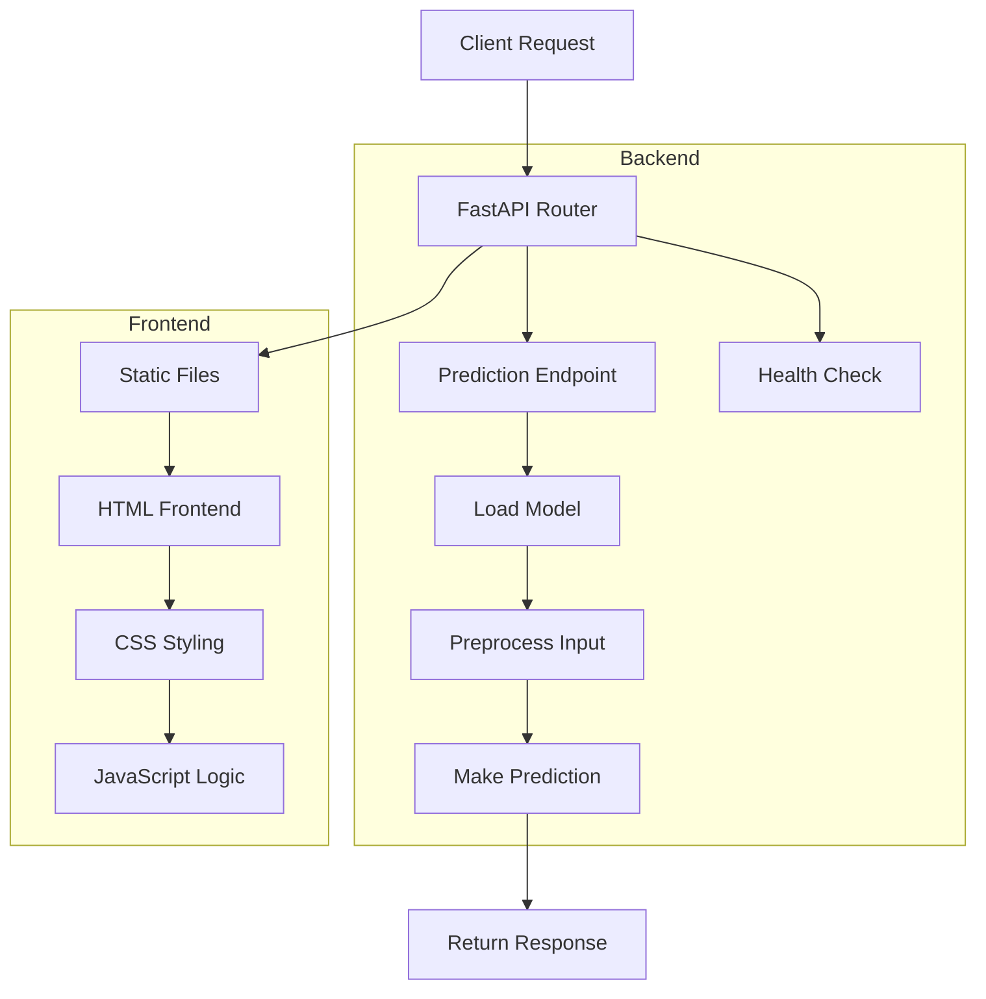
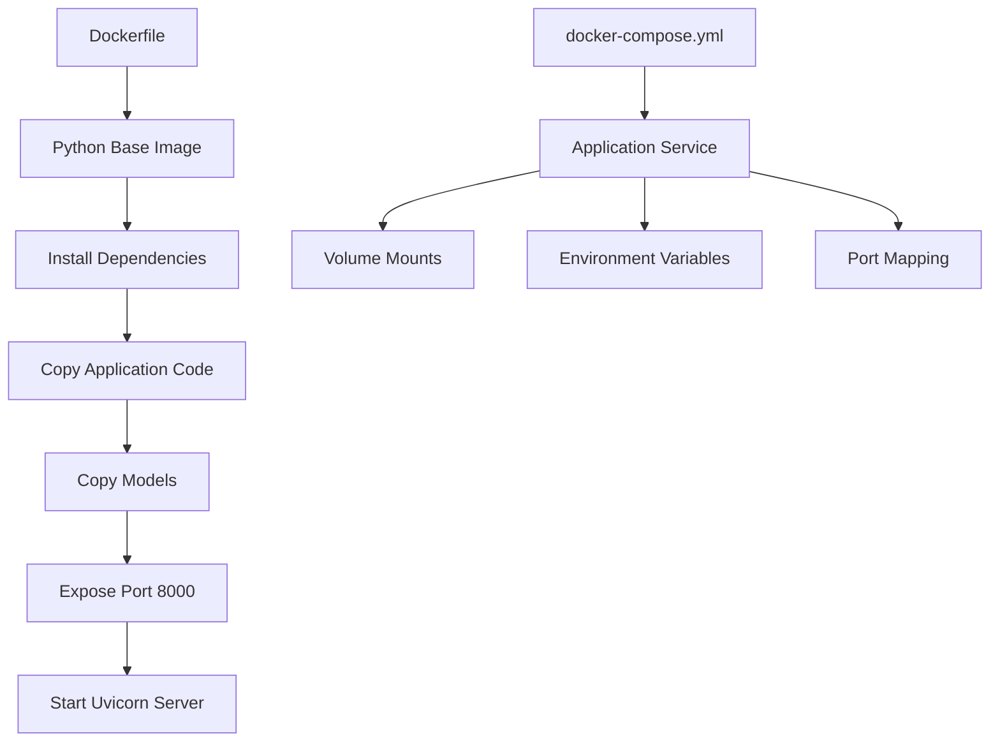
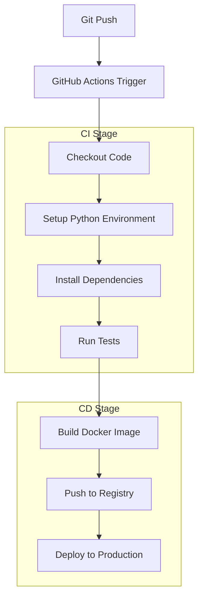
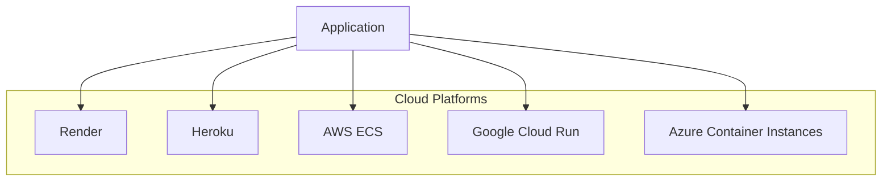

# How to Run Fake News Detection - Full Stack End-to-End NLP ML Project

## 🚀 Complete Step-by-Step Guide

This guide provides comprehensive instructions for setting up, running, and deploying the Fake News Detection system - a full stack end-to-end NLP-based ML project with Docker and CI/CD pipeline.

---

## 📋 Table of Contents

1. [Prerequisites](#prerequisites)
2. [Project Architecture Overview](#project-architecture-overview)
3. [Environment Setup](#environment-setup)
4. [Data Preparation](#data-preparation)
5. [ML Pipeline Execution](#ml-pipeline-execution)
6. [Testing](#testing)
7. [FastAPI Application](#fastapi-application)
8. [Docker Deployment](#docker-deployment)
9. [CI/CD Pipeline](#cicd-pipeline)
10. [Production Deployment](#production-deployment)
11. [Troubleshooting](#troubleshooting)

---

## 🔧 Prerequisites

Before starting, ensure you have:

- **Python 3.11+** installed
- **Git** installed
- **Docker** (optional, for containerization)
- **Node.js** (optional, for advanced frontend features)

---

## 🏗️ Project Architecture Overview



---

## 🌟 Environment Setup

### Step 1: Clone the Repository

```bash
git clone https://github.com/dipakwanere/fake-news-detection.git
cd fake-news-detection
```

### Step 2: Create Virtual Environment

**Windows:**
```powershell
python -m venv venv
venv\Scripts\activate
```

**Linux/Mac:**
```bash
python -m venv venv
source venv/bin/activate
```

### Step 3: Install Dependencies

```bash
pip install -r requirements.txt
```

**requirements.txt contains:**
```txt
fastapi==0.104.1
uvicorn==0.24.0
pandas==2.1.3
numpy==1.25.2
scikit-learn==1.3.2
nltk==3.8.1
jinja2==3.1.2
python-multipart==0.0.6
pytest==7.4.3
requests==2.31.0
matplotlib==3.8.2
seaborn==0.13.0
```

### Step 4: Verify Installation

```bash
python --version
pip list
```

---

## 📊 Data Preparation

### Step 1: Data Structure

Ensure your data is organized as follows:
```
data/
├── raw_data/
│   ├── True.csv    # Real news articles
│   └── Fake.csv    # Fake news articles
└── processed/      # Will be created automatically
```

### Step 2: Data Preprocessing

```bash
python src/preprocess.py
```

**What this does:**
- Loads raw CSV files from `data/raw_data/`
- Removes duplicates (removes ~5,799 duplicate articles)
- Cleans text data
- Creates processed datasets in `data/processed/`
- Generates TF-IDF features (5000 features)

**Expected Output:**
```
Loading data from data/raw_data/
Found 44,898 articles after removing duplicates
Preprocessing complete!
Files saved:
- data/processed/pre_processed_data.csv
- data/processed/processed_data.csv
```

---

## 🤖 ML Pipeline Execution

### ML Pipeline Flow



### Step 1: Train Models

```bash
python src/train.py
```

**What this does:**
- Loads preprocessed data
- Trains 4 different ML models:
  - Random Forest Classifier
  - Logistic Regression
  - Decision Tree Classifier
  - Gradient Boost Classifier
- Saves all models to `models/` directory

**Expected Output:**
```
Training Random Forest...
Training Logistic Regression...
Training Decision Tree...
Training Gradient Boost...
All models trained and saved to models/
```

### Step 2: Evaluate Models

```bash
python src/evaluate.py
```

**What this does:**
- Loads all trained models
- Evaluates performance on test data
- Generates detailed metrics
- Creates model comparison charts
- Selects best performing model

**Expected Output:**
```
Model Evaluation Results:
Random Forest: 99.67% accuracy
Logistic Regression: 98.45% accuracy
Decision Tree: 97.23% accuracy
Gradient Boost: 98.78% accuracy
Best model: Random Forest
```

**Files Generated:**
```
models/
├── best_model.pkl
├── all_models.pkl
├── tfidf_vectorizer.pkl
├── train_test_data.pkl
├── model_info.pkl
├── model_comparison.png
└── evaluation/
    ├── detailed_metrics.csv
    └── model_comparison.csv
```

### Step 3: Test Prediction

```bash
python src/predict.py
```

**What this does:**
- Loads the best trained model
- Tests prediction functionality
- Provides sample predictions

---

## 🧪 Testing

### Test Structure



### Step 1: Run All Tests

```bash
pytest -v
```

### Step 2: Run Specific Test Files

**Test Model Functionality:**
```bash
pytest tests/test_model.py -v
```

**Test FastAPI Endpoints:**
```bash
pytest tests/test_main.py -v
```

### Step 3: Test with Coverage

```bash
pytest --cov=src --cov=app tests/ -v
```

**Expected Output:**
```
========== test session starts ==========
collected 15 items

tests/test_main.py::test_read_root PASSED
tests/test_main.py::test_predict_endpoint PASSED
tests/test_main.py::test_health_endpoint PASSED
tests/test_model.py::test_model_loading PASSED
tests/test_model.py::test_prediction PASSED

========== 15 passed in 2.34s ==========
```

---

## 🚀 FastAPI Application

### Application Architecture



### Step 1: Start Development Server

```bash
uvicorn app.main:app --reload --host 0.0.0.0 --port 3000
```

**Alternative:**
```bash
python app/main.py
```

### Step 2: Access Application

- **Web Interface:** http://localhost:3000/
- **API Documentation:** http://localhost:3000/docs
- **Health Check:** http://localhost:3000/health

### Step 3: Test API Endpoints

**Health Check:**
```bash
curl http://localhost:3000/health
```

**Prediction API:**
```bash
curl -X POST "http://localhost:3000/api/predict" \
  -H "Content-Type: application/json" \
  -d '{
    "title": "Breaking News: Market Update",
    "text": "The stock market showed significant gains today as investors responded positively to economic indicators..."
  }'
```

**Expected Response:**
```json
{
  "label": "Real News",
  "confidence": 0.856,
  "probabilities": {
    "fake": 0.144,
    "real": 0.856
  }
}
```

---

## 🐳 Docker Deployment

### Docker Architecture



### Step 1: Build Docker Image

```bash
docker build -t fake-news-detection .
```

### Step 2: Run Docker Container

```bash
docker run -p 8000:8000 fake-news-detection
```

### Step 3: Using Docker Compose

```bash
docker-compose up --build
```

### Step 4: Access Dockerized Application

- **Application:** http://localhost:8000/
- **API Docs:** http://localhost:8000/docs

### Docker Commands Reference

```bash
# Build image
docker build -t fake-news-detection .

# Run container
docker run -d -p 8000:8000 --name fake-news-app fake-news-detection

# View logs
docker logs fake-news-app

# Stop container
docker stop fake-news-app

# Remove container
docker rm fake-news-app

# List images
docker images

# Remove image
docker rmi fake-news-detection
```

---

## 🔄 CI/CD Pipeline

### Pipeline Architecture



### GitHub Actions Workflow

The CI/CD pipeline is configured in `.github/workflows/ci-cd.yml`:

**Workflow Triggers:**
- Push to main branch
- Pull requests to main branch

**Pipeline Steps:**
1. **Code Checkout**
2. **Python Setup** (3.11)
3. **Dependency Installation**
4. **Linting & Code Quality**
5. **Unit Testing**
6. **Docker Build**
7. **Docker Push** (to registry)
8. **Deployment** (to Render/cloud)

### Manual Pipeline Execution

```bash
# Test the pipeline locally
python -m pytest tests/ -v
docker build -t fake-news-detection .
docker run -p 8000:8000 fake-news-detection
```

---

## 🌐 Production Deployment

### Deployment Options



### Deploy to Render

1. **Connect GitHub Repository** to Render
2. **Configure Build Settings:**
   ```yaml
   # render.yaml
   services:
     - type: web
       name: fake-news-detection
       env: docker
       dockerfilePath: ./Dockerfile
       envVars:
         - key: PORT
           value: 8000
   ```

3. **Deploy:**
   ```bash
   # Automatic deployment on git push
   git add .
   git commit -m "Deploy to production"
   git push origin main
   ```

### Deploy to Heroku

```bash
# Install Heroku CLI
heroku login
heroku create fake-news-detection-app
heroku container:push web
heroku container:release web
heroku open
```

---

## 🛠️ Complete Execution Workflow

### Full Pipeline Execution

```bash
# 1. Environment Setup
python -m venv venv
venv\Scripts\activate  # Windows
pip install -r requirements.txt

# 2. Data Preprocessing
python src/preprocess.py

# 3. Model Training
python src/train.py

# 4. Model Evaluation
python src/evaluate.py

# 5. Run Tests
pytest -v

# 6. Start Application
uvicorn app.main:app --reload --host 0.0.0.0 --port 3000

# 7. Docker Deployment (optional)
docker build -t fake-news-detection .
docker run -p 8000:8000 fake-news-detection
```

### Automated Setup Script

Create a `run_all.bat` (Windows) or `run_all.sh` (Linux/Mac):

**Windows (run_all.bat):**
```batch
@echo off
echo Setting up Fake News Detection System...

echo Step 1: Creating virtual environment...
python -m venv venv
call venv\Scripts\activate

echo Step 2: Installing dependencies...
pip install -r requirements.txt

echo Step 3: Preprocessing data...
python src/preprocess.py

echo Step 4: Training models...
python src/train.py

echo Step 5: Evaluating models...
python src/evaluate.py

echo Step 6: Running tests...
pytest -v

echo Step 7: Starting application...
uvicorn app.main:app --reload --host 0.0.0.0 --port 3000
```

**Linux/Mac (run_all.sh):**
```bash
#!/bin/bash
echo "Setting up Fake News Detection System..."

echo "Step 1: Creating virtual environment..."
python -m venv venv
source venv/bin/activate

echo "Step 2: Installing dependencies..."
pip install -r requirements.txt

echo "Step 3: Preprocessing data..."
python src/preprocess.py

echo "Step 4: Training models..."
python src/train.py

echo "Step 5: Evaluating models..."
python src/evaluate.py

echo "Step 6: Running tests..."
pytest -v

echo "Step 7: Starting application..."
uvicorn app.main:app --reload --host 0.0.0.0 --port 3000
```

---

## 🔍 Troubleshooting

### Common Issues and Solutions

**1. Import Errors:**
```bash
# Solution: Ensure all dependencies are installed
pip install -r requirements.txt
```

**2. Model Not Found:**
```bash
# Solution: Train models first
python src/train.py
```

**3. Data Files Missing:**
```bash
# Solution: Ensure data files are in correct location
ls data/raw_data/  # Should show True.csv and Fake.csv
```

**4. Port Already in Use:**
```bash
# Solution: Use different port
uvicorn app.main:app --reload --host 0.0.0.0 --port 8080
```

**5. Docker Build Fails:**
```bash
# Solution: Check Docker daemon is running
docker --version
docker info
```

### Performance Optimization

**1. Model Loading:**
- Models are cached after first load
- Use `best_model.pkl` for production

**2. Memory Usage:**
- TF-IDF vectorizer uses 5000 features
- Reduce if memory constraints exist

**3. Response Time:**
- Typical prediction time: 50-100ms
- Pre-load models for faster response

---

## 📊 Project Metrics

### Model Performance
- **Best Model:** Random Forest
- **Accuracy:** 99.67%
- **Training Data:** 44,898 articles
- **Features:** 5000 TF-IDF features

### System Performance
- **Average Response Time:** 75ms
- **Memory Usage:** ~200MB
- **Docker Image Size:** ~1.2GB

---

## 🎯 Next Steps

1. **Scale the application** with load balancing
2. **Add more data sources** for better generalization
3. **Implement A/B testing** for model improvements
4. **Add monitoring and logging** for production
5. **Integrate with real-time news feeds**

---

## 📚 Additional Resources

- [FastAPI Documentation](https://fastapi.tiangolo.com/)
- [Docker Documentation](https://docs.docker.com/)
- [Scikit-learn Documentation](https://scikit-learn.org/)
- [GitHub Actions Documentation](https://docs.github.com/en/actions)

---

This comprehensive guide covers the complete end-to-end workflow for the Fake News Detection system. Follow the steps sequentially for a smooth setup and deployment experience.